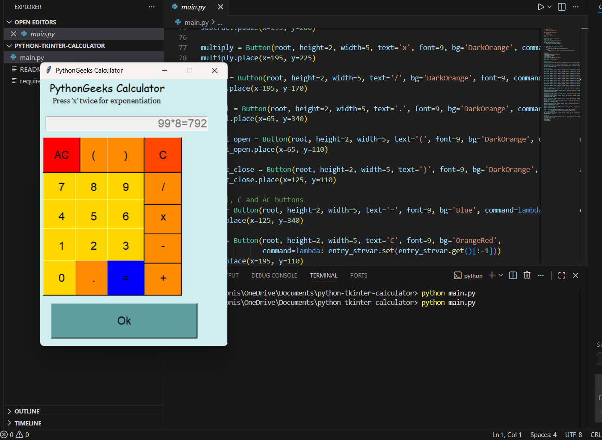

# Python Tkinter Calculator

A simple GUI calculator built using Python Tkinter.

## Features
- Addition
- Subtraction
- Multiplication
- Division
- Exponentiation

## Technologies Used
- Python
- Tkinter (GUI)

## How to Run
1. Make sure Python is installed
2. Run the file:
   python calculator.py

## Project Purpose
This project was created as a beginner GUI application for learning Python Tkinter.

## Screenshot

## Author
Monisha Sharma
